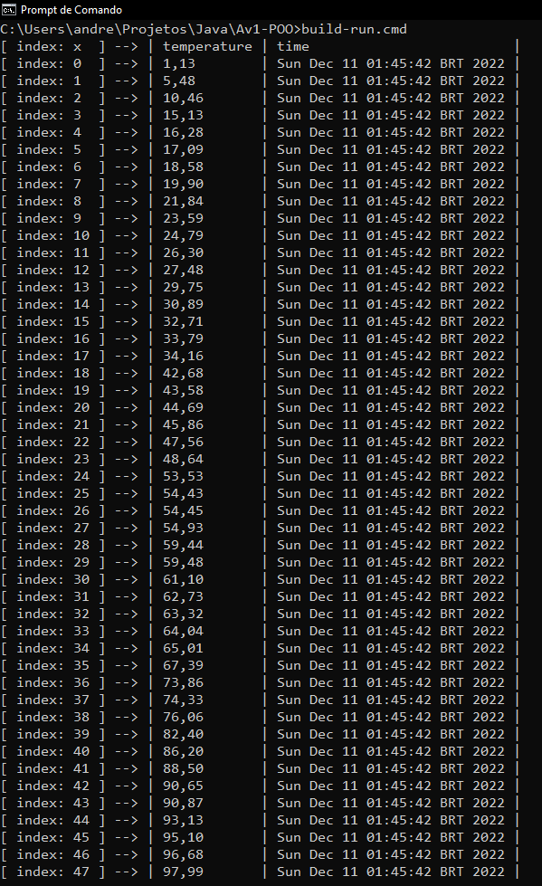

## Atividade 1 de Programação Orientada a Objetos 

Curso: Análise e Desenvolvimento de Sistemas <br>
Aluno: Andrey Allyson Viana Gomes <br>
Matricula: 01525971

- [Introdução.](#introdução)
- [Como funciona?](#como-funciona)
    - [Campos da instancia de EnvironmentRegistry.](#campos-da-instancia-de-environmentregistry)
    - [Metodos da classe EnvironmentStorage.](#metodos-da-classe-environmentstorage)
        - [Criação](#criação)
        - [Manipulação](#manipulação)
        - [Obtenção](#obtenção)
        - [Inserção](#inserção)
        - [Remoção](#remoção)
        - [Ordenação](#ordenação)
        - [Exibição](#exibição)
- [Como rodar na mina maquina?](#como-rodar-na-mina-maquina)
    - [Requerimentos.](#requerimentos)
    - [Primeiros passos no windons.](#primeiros-passos-no-windons)

## Introdução.

Olá, esse é um projeto de Orientação a Objetos onde o objetivo é criar uma classe que armazene dados relacionados a temperatura, quantidade de gás carbonico e humidade do ar, de forma que seja possivel a obtenção e manipulação desses dados.

## Como funciona?

Essa classe que foi citada, armazena em um lista as instancias da classe EnvironmentRegistry que possui os __campos__ que são requeridos para a execução da atividade.

### Campos da instancia de EnvironmentRegistry.

Essa classe serve unicamente para instanciar as __linhas__ da tabela representada pela instancia de `EnvironmentStorage`.

- `temperature` - temperatura do ambiente.

- `carbonDioxideQnt` - quantidade de gás carbono.

- `humidity` - humidade do ambiente.

- `time` - momento exato da extração dos dados.

### Metodos da classe EnvironmentStorage.

O foco do programa está nessa classe que fornece a [__criação__](#criação), [__manipulação__](#manipulação), [__obtenção__](#obtenção), [__inserção__](#inserção), [__remoção__](#remoção), [__ordenação__](#ordenação) e [__exibição__](#exibição) dos registros de uma maneira simplificada.

- #### Criação.

    - `EnvironmentRegistry createRegistry(...);`

        Cria um registro, o insere na ultima posição e o retorna logo após.

- #### Manipulação.

    - `void set(int index, EnvironmentRegistry value);`

        Altera o registro presente no índice fornecido.

- #### Obtenção.

    - `EnvironmentRegistry get(int index);`

        Retorna o registro presente no índice fornecido.

- #### Inserção.

    - `int push(...);`

        Insere ou cria um registro na ultima posição da lista e retorna o índice do registro.

- #### Remoção.

    - `EnvironmentRegistry pop();`

        Remove o ultimo registro da lista e o retorna logo após.

    - `EnvironmentRegistry pop(int index);`
    
        Remove o registro localizado no índice fornecido e o retorna logo após. 

- #### Ordenação.

    - `void sortByCarbonDioxideQnt();`

        Ordena de forma crescente os registros de acordo com o valor contido no campo __carbonDioxideQnt__.

    - `void sortByTemperature();`

        Ordena de forma crescente os registros de acordo com o valor contido no campo __temperature__.

    - `void sortByHumidity();`

        Ordena de forma decrescente os registros de acordo com o valor contido no campo __humidity__.

    - `void bubbleSort(SortCallback<EnvironmentRegistry> callback);`

        Método base de ordenação que recebe um __callback__ que retorna um __boolean__, esse retorno vai ditar a ordenação do metodo.
        
        `Exemplo`
        
        ```java
        storage.bubbleSort((leftValue, rightValue) -> leftValue.carbonDioxideQnt > rightValue.carbonDioxideQnt);
        ```

- #### Exibição.

    - `String toString(...);`

        Cria uma String formatada para uma vizualização no cmd, powerShell, bash e etc.

        `Resultado`

        <image src="images/toString-ilustration.png"/>

## Como rodar na mina maquina?

Aqui está um passo a passo para a execução correta do programa.

### Requerimentos.

Para testar e executar o codigo será necessário cumprir com os seguintes requisitos:

- Ter o `jdk 19.0.1` instalado na sua maquina.

    Eles permitirão o build e a execução do programa.

- Ter o `git` instalado na sua maquina.

    Ela permitirá a instalação do código fonte presente nesse repositório.

- Utilizar o sistema operacional `Windows`.

    Os scripts de build e execução foram feitos apenas na linguagem `batch`, então por enquanto só as maquinas com esse sistema operacional podem executar esse programa.

    Eu estou trabalhando para que __Linux__ e __macOS__ tambem possam executa-lo.

___Atentão___: 
- O `javapath` precisa estar exposto na variável de sistema `Path`.
- O jdk deve ser da versão 19.0.1 ou superior.

### Primeiros passos no Windons

Abra o Prompt de Commandos (cmd).

Execute os seguintes comandos.

```batch
git clone https://github.com/Andrey20Allyson/Av1-POO
```
Clona o repositório na sua maquina.

```batch
cd Av1-POO
```
Entra no root do programa, apenas aí poderá ser executado os scripts.

```batch
build-run
```
Realiza o processo de build e executa a classe Main logo após.

Fazendo isso, deve aparecer algo parecido com isso: 



Pronto agora você poderá realizar os testes e implementar o que quiser.